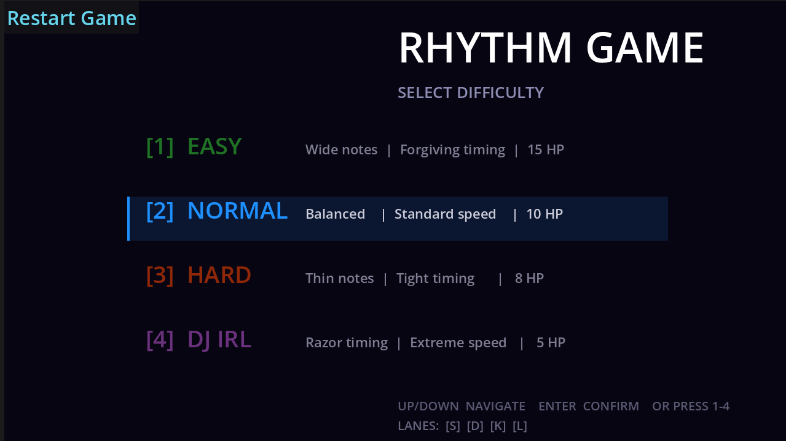
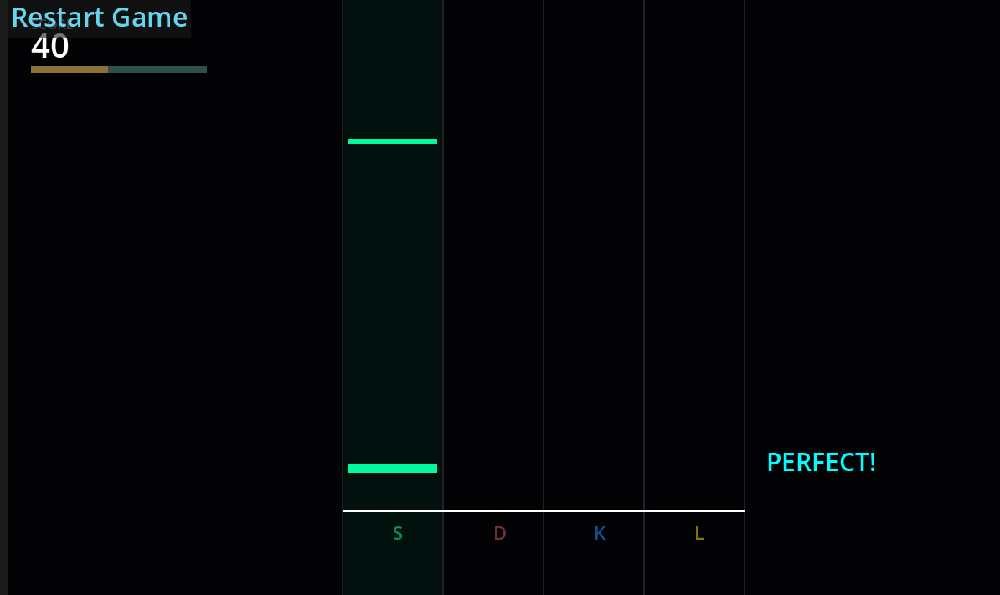
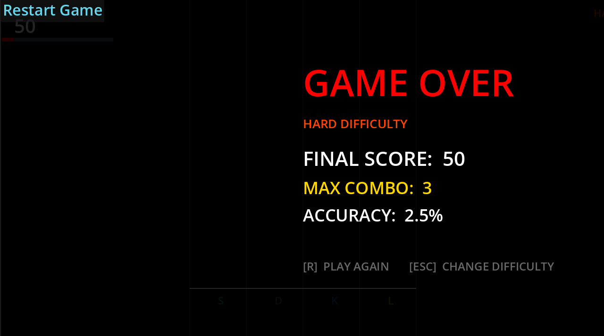

# Rhythm Ravage

A fast-paced 4-lane rhythm game built with the Godot Engine where timing, accuracy, and reaction speed will be tested through multiple rhythm challenges.

---

## Overview

Rhythm Ravage is a rhythm-based game where notes travel across 4 lanes toward a judgment line. Players must press the correct key at the correct time to maintain combos, preserve HP, and achieve high accuracy scores.

The game focuses on responsive gameplay, visual feedback, and progressively harder difficulties that demand faster reactions and tighter precision.

---

## Gameplay

Hit notes using:

- Lane 1 → `S`
- Lane 2 → `D`
- Lane 3 → `K`
- Lane 4 → `L`

Performance is measured via:
- Accuracy
- Combo streaks
- Score
- Remaining HP

---

## Features

- 4-lane rhythm gameplay
- Combo and scoring system
- Accuracy tracking
- Health system
- Multiple difficulties
- Hit detection
- Restart system

---

## Difficulties

| Difficulty | Description |
|------------|-------------|
| EASY | Larger hit boxes, slow notes, and 15 HP |
| NORMAL | Balanced gameplay and 10 HP |
| HARD | Faster notes and tighter hit boxes |
| DJ IRL | Extreme speed and precesion with only 5 HP |

---

## Controls

### Menu
- `1-4` → Select difficulty
- `UP / DOWN` → Navigate
- `ENTER` → Start game

### Gameplay
- `S D K L` → Hit notes

### Game Over
- `R` → Restart
- `ESC` → Return to menu

---

## Screenshots

### Menu

### Gameplay

### Game Over

---

## Tech Stack

- Godot Engine
- GDScript

---

## How It Works

### Notes:
Notes spawn in timed intervals, moving towards the judgment line at speeds based on the selected difficulty.

### Hits:
Player input is checked against note timing windows determining:
- Perfect Hit
- Early Hit
- Late Hit
- Miss (-1 HP)

### Scoring:
Scores are calculated using:
- Timing accuracy
- Combo multiplier
- Successful hits

### Health:
Missing notes or inaccurate hits reduce HP. The game ends when HP reaches zero.

---

## Motivation

This project was developed as a hobby project and rhythm game experiment in my freetime. The challenged myself to complete it before my finals. The focus was creating a complete and polished gameplay loop within a short development timeframe. Anyway, i couldn't do that, although I created the game it had some flaws considering controls, loud music, and I personally would play it in my freetime. I couldn't fix these things before cause I needed to study, but now returned to working on it where those bugs were fixed and new features were added, such as that of difficulties.

---

## Installation

### Run Locally

1. Clone the repository
2. Open the project in Godot
3. Press `F5` to run

---

## Web Version

https://zoghby.itch.io/rhythm-ravage
